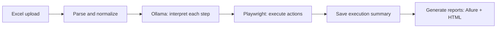
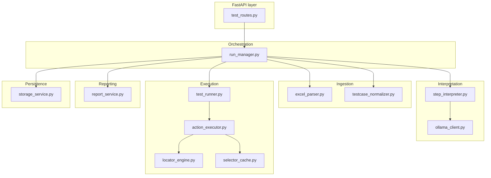
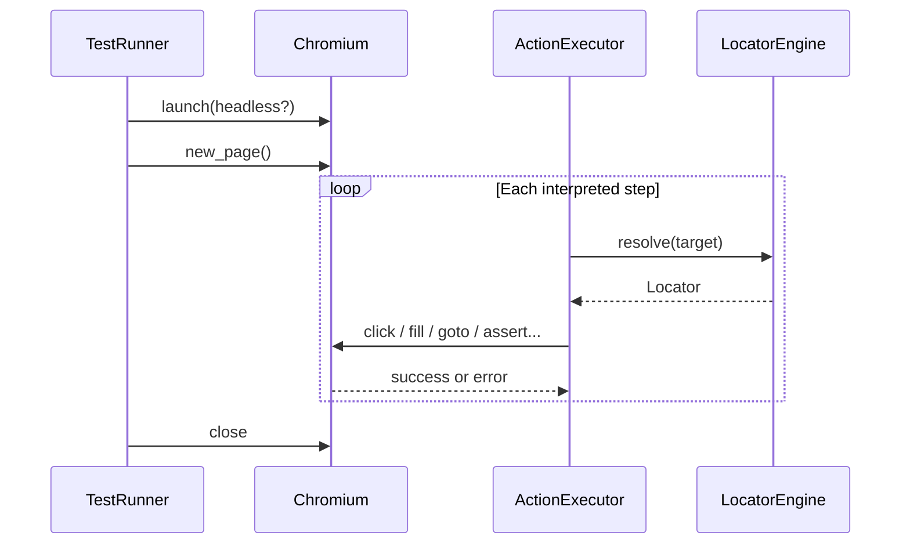

# AI-Assisted Excel Test Automation

This document explains the **purpose**, **architecture**, **folder structure**, and **every major component** of this project so that **non-technical** readers (for example, QA planning tests) and **technical** readers (developers extending the system) can work with it from a single place.

---

## 1. What is this project? (Non-technical overview)

**In simple terms:**  
You (or your QA team) write test cases in an **Excel file** using plain language—like a manual test script. The system **reads** that file, uses a **local AI** (Ollama) to **understand** each step, and then **runs** those steps in a **real web browser** (Chromium via Playwright). It records **pass/fail** for each step, saves **screenshots** and **page dumps** when something fails, and produces **reports** you can open in a browser.

**You do not** put technical selectors (XPath, CSS, `data-testid`) in Excel—the tool tries to find elements by meaning and simple rules.

**You do** need a running **application under test** (a website URL) and, for the AI part, a running **Ollama** service on your machine (or network).

---

## 2. Why does this project exist? (Purpose)

- **Faster feedback:** Turn spreadsheet-style test cases into automated runs without writing full code for every test.
- **Local AI:** Use **Ollama** so test data and prompts can stay on your environment (no cloud LLM required for the designed flow).
- **Traceability:** Every run gets a **unique folder** with input Excel, intermediate JSON, logs, screenshots, and summaries.
- **Reporting:** Build **Allure-style** result files and an **HTML dashboard** per run for review.
- **Split interpret vs execute (optional):** Run the LLM **once** per workbook snapshot, then replay **browser-only** executions as often as needed—see **`POST /interpret`** and **`POST /execute-versioned`**.
- **Versioned executions:** Repeated browser runs for the same `run_id` can be stored under **`executions/exec_<timestamp>_<id>/`** so prior reports and screenshots are not overwritten.
- **Manual fixes:** **`PATCH`** a run’s **`interpreted_steps.json`** to correct bad LLM output without re-calling Ollama.

---

## 3. High-level flow (how a test run works)



**Step-by-step (what happens in the product):**

1. **Upload** an `.xlsx` / `.xls` file. The server stores it and returns a **`file_id`**.
2. **Start a run** with that `file_id`. The server creates a **`run_id`** and copies the Excel into `storage/runs/<run_id>/input.xlsx`.
3. **Normalize:** Rows become structured JSON (`normalized_testcases.json`) with columns like module, steps, test data.
4. **Interpret:** For each manual step, **Ollama** returns a small JSON action (`goto`, `click`, `fill`, etc.) (`interpreted_steps.json`).
5. **Execute:** **Playwright** drives Chromium against **`BETA_BASE_URL`** or **`LIVE_BASE_URL`** from `.env`, step by step.
6. **Report:** Writes **`execution_summary.json`**, **Allure** JSON files under `allure-results/`, and **`report.html`**.

**Optional two-phase flow (same Excel, many browser runs, one LLM pass):**

1. **Upload** → `file_id` (unchanged).
2. **`POST /interpret`** with the same JSON shape as **`/run`** (`InterpretRunRequest`). Creates **`run_id`**, **normalize** + **interpret** only; status ends at **`interpreted`**. No Playwright.
3. *(Optional)* **`PATCH /runs/{run_id}/interpreted-steps`** to merge manual edits into **`interpreted_steps.json`** (e.g. fix a wrong `action` / `target`).
4. **`POST /execute-versioned`** with **`interpret_run_id`** = that **`run_id`**. Loads **`interpreted_steps.json`** + **`normalized_testcases.json`**, runs Playwright, writes artifacts under **`executions/exec_<UTC>_<suffix>/`** (new folder per invocation). **No LLM** on this call.
5. **Read results** via **`GET /versioned/{run_id}/executions/...`** (list, summary, HTML report) for versioned runs.

---

## 4. Architecture (technical)



| Layer | Responsibility |
|--------|----------------|
| **API** | HTTP endpoints: upload, full **`/run`**, **`/interpret`**, **`/execute-versioned`**, **`PATCH`** interpreted steps, versioned execution reads, status, summary, reports. |
| **Run manager** | Single place that orders phases and writes run logs; split interpret/execute and versioned execution paths. |
| **Excel + normalizer** | Excel → structured test cases. |
| **Ollama client + interpreter** | Natural language step → JSON action. |
| **Test runner + executor** | Playwright runs actions; locator engine finds elements. |
| **Report service** | Allure JSON + HTML report from execution summary. |
| **Storage** | Files under `storage/uploads` and `storage/runs`. |

---

## 5. Tech stack and libraries

| Technology | Role |
|------------|------|
| **Python 3** | Main language. |
| **FastAPI** | Web framework for REST APIs. |
| **Uvicorn** | ASGI server to run FastAPI. |
| **Pydantic** | Request/response validation and data models. |
| **python-multipart** | Accept file uploads. |
| **pandas** + **openpyxl** | Read Excel workbooks. |
| **requests** | Call Ollama HTTP API. |
| **python-dotenv** | Load `.env` into environment variables. |
| **Playwright (Python)** | Browser automation (Chromium). |
| **Ollama** (installed separately) | Local LLM inference (`/api/generate`). |

**Dependencies** are listed in `requirements.txt`.

---

## 6. Folder structure

Below is the **application** layout (excluding virtualenv, `__pycache__`, and generated `storage` content).

```text
AI_Automation_Testing/
├── README.md                 ← This file
├── requirements.txt          ← pip dependencies
├── .env.example              ← Example environment variables (copy to .env)
├── .env                      ← Your local secrets/URLs (do not commit)
├── app/
│   ├── main.py               ← FastAPI app, health check, router mount
│   ├── config.py             ← Settings from environment variables
│   ├── api/
│   │   └── routes/
│   │       └── test_routes.py  ← All /api/tests/* endpoints
│   ├── core/
│   │   ├── constants.py      ← Run status string constants
│   │   ├── exceptions.py     ← App-specific errors
│   │   └── logger.py         ← Logging helper
│   ├── models/               ← Pydantic models (API + domain)
│   ├── services/             ← Business logic
│   └── utils/                ← Small helpers
├── docs/                     ← Extra documentation (requirements, architecture notes)
├── storage/                  ← Runtime data (uploads, runs) — often gitignored
│   ├── uploads/              ← Uploaded Excel files + upload metadata JSON
│   └── runs/<run_id>/        ← Per-run artifacts (see section 9)
└── tests/                    ← Placeholder for automated tests
```

---

## 7. Configuration (`app/config.py` and `.env`)

Settings are read from **environment variables** (with defaults). `load_dotenv()` loads a **`.env`** file in the project root when present.

**Important variables** (see `.env.example`):

| Variable | Meaning |
|----------|---------|
| `APP_NAME`, `APP_VERSION` | Shown in OpenAPI / docs. |
| `API_PREFIX` | Default `/api` — routes become `/api/tests/...`. |
| `STORAGE_ROOT`, `UPLOADS_DIR_NAME`, `RUNS_DIR_NAME` | Where files are stored. |
| `HEADLESS` | Default browser headless mode for runs that omit `headless` in JSON (API body overrides per request). |
| `STEP_TIMEOUT_MS` | Default timeout for Playwright steps (ms). |
| `STEP_RETRY_MAX`, `STEP_RETRY_DELAY_MS` | Retries on flaky locator interactions. |
| `OLLAMA_URL`, `OLLAMA_MODEL`, `OLLAMA_TIMEOUT_S`, `OLLAMA_JSON_FORMAT` | Local LLM connection and JSON mode. |
| `BETA_BASE_URL`, `LIVE_BASE_URL` | Application URLs for `environment=beta` vs `live`. |
| `DEFAULT_TIMEOUT` | Default navigation / action timeout (ms). |
| `SCREENSHOT_ON_FAILURE` | Capture screenshots on failed steps. |

---

## 8. REST API (what each endpoint does)

Base URL example: `http://127.0.0.1:8000`. Interactive docs: `http://127.0.0.1:8000/docs`.

### `GET /health`

- **Purpose:** Check that the API is up and whether **Ollama** responds (`ollama_reachable`).

**Example response:**

```json
{"status": "ok", "ollama_reachable": true}
```

---

### `GET /api/tests/metrics`

- **Purpose:** Return simple dashboard counters from run metadata.
- **Response (`RunMetricsResponse`):**
  - `total_runs`
  - `by_status` (counts per run status)
  - `runs_last_24h`
  - `runs_last_7d`
  - `active_runs`
  - `queued_runs`
  - `cancelled_runs`

---

### `POST /api/tests/upload`

- **Purpose:** Upload one Excel file containing test cases.
- **Input:** `multipart/form-data` with field name **`file`**, file extension `.xlsx` or `.xls`.

**Example (conceptual):**  
Use Swagger UI “Try it out” or send `file=@MyTests.xlsx`.

**Example response:**

```json
{
  "success": true,
  "file_id": "f_20260501_120000_a1b2c3",
  "filename": "LoginTests.xlsx",
  "stored_path": "storage/uploads/f_20260501_120000_a1b2c3.xlsx"
}
```

---

### `POST /api/tests/run`

- **Purpose:** Create a **run**, parse Excel, interpret steps with Ollama, execute in browser, write reports.
- **Body (JSON):** `RunRequest` — main fields:

| Field | Type | Description |
|-------|------|-------------|
| `file_id` | string | From upload response. |
| `environment` | `"beta"` \| `"live"` | Chooses `BETA_BASE_URL` vs `LIVE_BASE_URL`. |
| `headless` | boolean | `false` = **visible browser** (good for demos). |
| `continue_on_failure` | boolean | If `false`, stop testcase after first failed step. |
| `step_timeout_ms` | number | Per-step timeout override. |
| `max_cases` | number \| null | Optional cap on number of test cases. |
| `allow_live_mutations` | boolean | **Required `true`** for `environment=live` if steps mutate the site (click/fill/hover); otherwise API returns **403**. |

**Example body:**

```json
{
  "file_id": "f_20260501_120000_a1b2c3",
  "environment": "beta",
  "headless": false,
  "continue_on_failure": true,
  "step_timeout_ms": 30000
}
```

**Example success response:**

```json
{
  "success": true,
  "run_id": "run_20260501_120530_abcd",
  "status": "completed"
}
```

**Note:** This endpoint runs the **full pipeline synchronously** until finish — long Excel files can take many minutes (many LLM calls + browser steps).

---

### `POST /api/tests/interpret`

- **Purpose:** **Normalize + interpret only** (Ollama per step). Does **not** start Playwright. Same request body as **`/run`** (`InterpretRunRequest` — same fields as **`RunRequest`**).
- **Response:** `RunResponse` with **`run_id`** and status **`interpreted`** (when successful).
- **Use with:** **`POST /execute-versioned`** and optional **`PATCH .../interpreted-steps`**.

---

### `POST /api/tests/runs/list`

- **Purpose:** Paginated run listing for frontend grids (POST request contract with search, filters, sorting).
- **Body (`RunListRequest`):**
  - `page`, `limit`
  - `search` (optional text across run_id/file_id/status/environment)
  - `sortingOptions`: `{ "sortBy": "created_at|updated_at|run_id|file_id|status|environment", "sortOrder": "asc|desc" }`
  - `filters`: list of `{ "field", "operator", "value" }`, where `operator` is `equals|contains|gte|lte`.
- **Response:** `RunListPostResponse` with `data.list` and `data.meta` (`currentPage`, `totalPages`, `totalItems`, `itemsPerPage`, `hasNextPage`, `hasPreviousPage`).

---

### `GET /api/tests/runs/{run_id}/interpreted-steps`

- **Purpose:** Read current interpreted JSON for editor screens.
- **Response:** `InterpretedStepsReadResponse` with `interpreted_steps` and `revision`.

---

### `PATCH /api/tests/runs/{run_id}/interpreted-steps`

- **Purpose:** **Merge** manual edits into **`interpreted_steps.json`** without re-running the LLM. Send only the testcase(s) and step row(s) to change.
- **Body:** `InterpretedStepsPatchRequest` — **`patches`**: list of `{ "test_case_id", "step_patches": [ { "step_index", optional "raw_step" / "interpreted" / "interpretation_error" } ] }` **or** `{ "test_case_id", "steps": [ ... full InterpretedStepRecord list ... ] }` to replace all steps for one case (not both modes in one patch object).
- **Optimistic lock:** Optional `expected_revision` in the request body. If provided and stale, API returns **409**.
- **Semantics:** Only JSON keys you include on a step patch are applied (omit a field to leave it unchanged; use JSON **`null`** on **`interpreted`** or **`interpretation_error`** to clear).
- **Responses:** **`409`** if **`run_meta.status`** is **`running`** or revision mismatched; **`404`** if run or file missing; **`422`** if merged JSON fails validation.
- **Side effect:** Backs up the previous file to **`interpreted_steps.backup.<UTC_ts>.json`**, then atomically replaces **`interpreted_steps.json`**.

---

### `POST /api/tests/execute-versioned`

- **Purpose:** **Browser execution only** using an existing run folder’s **`interpreted_steps.json`** and **`normalized_testcases.json`**. **No Ollama** calls.
- **Body (`ExecuteFromInterpretedRequest`):**

| Field | Type | Description |
|-------|------|-------------|
| `interpret_run_id` | string | **`run_id`** from **`POST /interpret`** (or any run that already has interpreted JSON). |
| `environment` | `"beta"` \| `"live"` | Same as **`/run`**. |
| `headless` | boolean | |
| `continue_on_failure` | boolean | |
| `step_timeout_ms` | number | |
| `allow_live_mutations` | boolean | **Required `true`** for **`environment=live`** when steps mutate the site (**403** otherwise). |

- **Response:** `VersionedExecutionResponse`: **`run_id`**, **`execution_id`** (folder name under **`executions/`**), **`status`**.
- **Artifacts:** Each call creates **`storage/runs/<run_id>/executions/<execution_id>/`** with **`execution_summary.json`**, **`report.html`**, **`allure-results/`**, **`screenshots/`**, **`html/`**. Appends **`executions/manifest.json`** and updates **`executions/latest.json`**.

---

### `POST /api/tests/runs/{run_id}/cancel`

- **Purpose:** Cooperative cancellation request for in-flight execution.
- **Behavior:** Marks `cancel_requested=true` in `run_meta`; runner checks this flag between cases/steps and exits with status `cancelled`.
- **Response:** `CancelRunResponse`.

---

### `POST /api/tests/runs/cleanup`

- **Purpose:** Retention cleanup for old run folders.
- **Body (`CleanupRunsRequest`):** `retain_days`, `dry_run`, `max_delete`.
- **Response:** `CleanupRunsResponse` (`deleted_run_ids`, `scanned`).

---

### `GET /api/tests/versioned/{run_id}/executions`

- **Purpose:** List recorded versioned executions (manifest entries).

---

### `GET /api/tests/versioned/{run_id}/executions/{execution_id}/summary`

- **Purpose:** Full **`execution_summary.json`** for that **`execution_id`**.

---

### `GET /api/tests/versioned/{run_id}/executions/{execution_id}/reports`

- **Purpose:** Paths to Allure dir, file list, and **`report.html`** **inside** that execution folder.

---

### `GET /api/tests/versioned/{run_id}/executions/{execution_id}/report.html`

- **Purpose:** Serve the HTML dashboard for that versioned execution.

---

### `GET /api/tests/runs/{run_id}/executions/latest`

- **Purpose:** Return latest versioned execution pointer + manifest row.

---

### `GET /api/tests/runs/{run_id}/artifacts`

- **Purpose:** Consolidated artifact index for UI evidence panels.
- **Query:** optional `execution_id`; if omitted, backend resolves latest versioned execution when available.

---

### `GET /api/tests/results/{run_id}`

- **Purpose:** Lightweight status + counts (from root **`execution_summary.json`** when present — see note below).

---

### `GET /api/tests/results/{run_id}/summary`

- **Purpose:** Return execution summary JSON.
- **Query:** optional `execution_id` to target one versioned execution.

If `execution_id` is omitted, backend prefers root summary and falls back to latest versioned summary when root file is absent.

---

### `GET /api/tests/reports/{run_id}`

- **Purpose:** Paths to **Allure** results directory, list of result files, and **`report.html`** path.
- **Query:** optional `execution_id` to target one versioned execution directly.

---

### `GET /api/tests/reports/{run_id}/html`

- **Purpose:** Download/serve the generated **`report.html`** file for that run.
- **Query:** optional `execution_id` to serve HTML report from a specific versioned execution.

---

## 9. What gets saved per run (`storage/runs/<run_id>/`)

**Always (after create + normalize):**

| Path | Description |
|------|----------------|
| `input.xlsx` | Copy of the uploaded workbook used for this run. |
| `run_meta.json` | Run ID, environment, headless, status, timestamps, `cancel_requested`. |
| `normalized_testcases.json` | Parsed test cases with `steps[]` and `test_data{}`. |
| `logs/run.log` | Append-only text log of phases and major events. |

**After interpret (LLM) or full `/run`:**

| Path | Description |
|------|----------------|
| `interpreted_steps.json` | Structured actions per step (`action`, `target`, `value_key`, …). May be **PATCH**ed manually. |
| `interpreted_steps.meta.json` | Revision metadata used for optimistic locking (`expected_revision`). |
| `interpreted_steps.backup.<UTC_ts>.json` | Created when **`PATCH .../interpreted-steps`** runs (previous snapshot). |

**After full `POST /run` only (classic single execution at run root):**

| Path | Description |
|------|----------------|
| `execution_summary.json` | Pass/fail per step, URLs, errors, screenshot paths. |
| `screenshots/` | PNG screenshots (evidence / failures). |
| `html/` | HTML snapshots for debugging. |
| `allure-results/` | Allure JSON files. |
| `report.html` | HTML dashboard at **run root**. |

**After `POST /execute-versioned` (each browser invocation):**

Under **`executions/exec_<YYYYMMDD_HHMMSS>_<suffix>/`** (unique **`execution_id`** per call):

| Path | Description |
|------|----------------|
| `execution_summary.json` | Summary for **this** execution only. |
| `report.html` | Dashboard for **this** execution. |
| `allure-results/` | Allure JSON for **this** execution. |
| `screenshots/` | Screenshots for **this** execution. |
| `html/` | HTML dumps for **this** execution. |

At **`executions/`** root (same run folder):

| Path | Description |
|------|----------------|
| `manifest.json` | Append-only list of versioned executions (timestamps, status, counts). |
| `latest.json` | `{"execution_id": "..."}` — last **`execute-versioned`** completion. |

Empty **`screenshots/`** and **`html/`** may also exist at **run root** from **`create_run`**; the versioned path is what **`execute-versioned`** uses for new evidence.

---

## 10. Excel format (for QA authors)

Expected columns (aliases supported — see `ExcelParser`):

- **Module** — feature area (e.g. Login).
- **Test Case ID** — stable ID (e.g. `TC_LOGIN_001`).
- **Test Case Name** — short title.
- **Scenario** — optional narrative.
- **Preconditions** — optional.
- **Test Steps** — multiline or numbered steps (one logical action per line is best).
- **Test Data** — semicolon-separated key:value pairs, e.g. `email: user@test.com; password: Secret123`.
- **Expected Result** — what “good” looks like in words.

**Tips for stable automation:**

- Write **explicit** steps: “Click **Sign In** link in the header” rather than “Click login”.
- Put credentials and test inputs in **Test Data**, not only in prose.
- For assertions, name **exact** UI text when possible (“Verify toast **Order placed**”).

Sample files may live under `docs/` (e.g. `TestCases_Login_Module_Sample.xlsx`).

---

## 11. File-by-file reference (`app/`)

### `app/main.py`

- **Purpose:** Create the FastAPI `app`, include the tests router under `settings.api_prefix`, run startup hook to ensure storage dirs exist.
- **Middleware / handlers:** adds `x-request-id` on every response and returns a standardized error envelope for `HTTPException` and unhandled exceptions.
- **Endpoints defined here:** `GET /health`.
- **Functions:** `on_startup()`, `health()`, request-id middleware, global exception handlers.

---

### `app/config.py`

- **Purpose:** Single **`Settings`** dataclass: paths, Ollama, timeouts, base URLs, retries.
- **Exports:** `settings` singleton used across services.

---

### `app/api/routes/test_routes.py`

- **Purpose:** All REST endpoints under **`/api/tests`** (plus prefix from config).
- **Key behaviors:**
  - **`GET /metrics`:** Lightweight counters for dashboard cards.
  - Validates upload extension and empty files.
  - **`POST /runs/list`:** Paginated/searchable/sortable run listing.
  - **`POST /run`:** Full pipeline; blocks unsafe live runs unless `allow_live_mutations=true`.
  - **`POST /interpret`:** Interpret only (no browser).
  - **`GET /runs/{run_id}/interpreted-steps`:** Returns interpreted JSON + revision.
  - **`PATCH /runs/{run_id}/interpreted-steps`:** Merge manual edits with optional revision lock; maps **`ConflictError`** → **409**.
  - **`POST /execute-versioned`:** Playwright only; versioned execution folders.
  - **`POST /runs/{run_id}/cancel`:** Cooperative cancellation request.
  - **`POST /runs/cleanup`:** Retention cleanup/dry-run endpoint.
  - **`GET /runs/{run_id}/executions/latest`**, **`GET /runs/{run_id}/artifacts`** for frontend helpers.
  - **`GET /versioned/...`:** List executions, summary, report paths, HTML.
  - Delegates to **`RunManager`** and maps exceptions to HTTP errors (`400`, `404`, `403`, `409`, `422`, `503`, `500`).
  - Serves **`report.html`** via **`FileResponse`** (root and versioned).

---

### `app/services/run_manager.py`

- **Purpose:** Orchestrates the pipeline end-to-end.
- **Main methods:**
  - `create_run` — creates folder + `run_meta.json`.
  - `generate_normalized_testcases` — Excel → `normalized_testcases.json`.
  - `generate_interpreted_steps` — Ollama per step → `interpreted_steps.json`; may fail fast if Ollama is entirely down.
  - `execute_interpreted_cases` — Playwright at **run root** → `execution_summary.json` → **`ReportService`** (used by **`POST /run`**).
  - `interpret_only` — **`create_run`** + normalize + interpret (no browser).
  - `execute_interpreted_versioned` — Playwright under **`executions/<execution_id>/`**, manifest + latest pointer.
  - `patch_interpreted_steps` — merge **`InterpretedStepsPatchRequest`** into JSON; raises **`ConflictError`** if status is **`running`** or revision mismatched.
  - `request_cancel` — mark run for cooperative cancellation.
  - `cleanup_runs` — retention cleanup for old run directories.
  - `get_artifact_index` — consolidated artifact payload for UI.
  - `list_versioned_executions`, `get_versioned_execution_summary`, `get_versioned_report_index` — versioned reads.
  - `get_run_counts`, `get_execution_summary`, `get_report_index` — classic root artifacts.
- **`_log`:** Writes timestamped lines to console logger **and** `logs/run.log`.

---

### `app/services/storage_service.py`

- **Purpose:** All filesystem operations for uploads and runs.
- **Examples:** `save_upload`, `create_run`, `write_json`, `read_json`, `append_text`, `update_run_status`, `get_run_dir`.
- **Versioned / patch helpers:** `create_versioned_execution_dir`, `write_json_relative`, `read_json_relative`, `update_run_execution_options`, `read_execution_manifest`, `append_execution_manifest`, `write_latest_execution_pointer`, `get_latest_execution_id`, `backup_interpreted_steps_if_exists`, `atomic_write_interpreted_steps`, interpreted revision helpers (`get_interpreted_revision`, `set_interpreted_revision`), cancellation helpers (`request_cancel_run`, `is_cancel_requested`), and retention helper (`delete_run_dir`).

---

### `app/services/excel_parser.py`

- **Purpose:** Read Excel with **pandas**; map flexible column headers via **`_COLUMN_ALIASES`**; **`split_steps`** splits multiline / numbered / inline numbered steps into a list of strings.

---

### `app/services/testcase_normalizer.py`

- **Purpose:** Turn **`RawExcelRow`** into **`NormalizedTestCase`** (trim text, parse `Test Data` into a dict, drop empty rows).

---

### `app/services/ollama_client.py`

- **Purpose:** HTTP client for **`POST /api/generate`** (and **`GET /api/tags`** for health).
- **Methods:** `generate_text`, `generate_json` (parse helper), `healthcheck`.

---

### `app/services/step_interpreter.py`

- **Purpose:** Build prompt → call Ollama → parse JSON → validate **`InterpretedStep`**.
- **Prompts:** Defined as **`_SYSTEM_RULES`**, **`_USER_TEMPLATE`**, and the **`repair_invalid_json`** repair string in `app/services/step_interpreter.py`. The exact text is duplicated for readability in **section 11.2 LLM prompts** (below).
- **Important behaviors:**
  - Long **system prompt** so **`goto`** is not used for “click link” steps.
  - **`_apply_action_overrides`** / **`_normalize_fill_step`:** reduce flaky mappings (e.g. infer **email** vs **password** field; clear bogus literal `value` when **`test_data`** should supply credentials).

---

### `app/services/test_runner.py`

- **Purpose:** Async Playwright orchestration.
- **Behavior:** For **each test case**, launches a **new Chromium** browser (so cases are isolated), creates page, runs all interpreted steps with **`ActionExecutor`**, uses **`SelectorCache`** per testcase, picks **`beta_base_url`** vs **`live_base_url`** from environment.
- **Optional:** Keyword argument **`artifact_base_dir`** — when set (e.g. by **`execute_interpreted_versioned`**), screenshots and HTML dumps go under that directory instead of **run root** (defaults preserve **`POST /run`** behavior).
- **Returns:** **`RunExecutionSummary`** aggregate.

---

### `app/services/action_executor.py`

- **Purpose:** Execute one interpreted step on a Playwright **`Page`**.
- **Actions supported (typical):** `goto`, `hover`, `click`, `fill`, `assert_visible`, `assert_text`, `wait`.
- **Important:** **`_resolve_fill_value`** prefers **`test_data[value_key]`** when the key exists so the LLM cannot override real passwords with the word `"password"`.
- **Safety:** **`environment=live`** can block mutating actions unless **`allow_live_mutations`** is true on the run.
- **Failures:** screenshots + HTML capture when configured.

---

### `app/services/locator_engine.py`

- **Purpose:** Resolve Playwright **locators** from natural **`target`** strings (roles, labels, text, email/password input heuristics). Used by **`ActionExecutor`** (and retries).

---

### `app/services/selector_cache.py`

- **Purpose:** In-memory cache for the **last successful locator “recipe”** per step key inside one testcase run (speed / stability when retrying).

---

### `app/services/report_service.py`

- **Purpose:** After execution, write:
  - **`allure-results/*-result.json`** — minimal Allure-compatible JSON per testcase.
  - **`report.html`** — human-readable HTML dashboard with links to evidence.

---

### `app/services/artifact_service.py`

- **Purpose:** **Placeholder** for future artifact packaging (zip bundles, etc.). Not used in core flow yet.

---

### `app/models/*.py`

| File | Contains |
|------|----------|
| `request_models.py` | **`RunRequest`**, **`InterpretRunRequest`**, **`ExecuteFromInterpretedRequest`**, **`InterpretedStepsPatchRequest`**, **`StepPatchItem`**, **`InterpretedCasePatch`**. |
| `response_models.py` | API responses including list pagination responses, **`VersionedExecutionResponse`**, **`VersionedExecutionsListResponse`**, **`VersionedExecutionSummaryResponse`**, **`InterpretedStepsPatchResponse`**, cancellation/cleanup responses, and artifact index response. |
| `run_models.py` | **`RunMeta`** (includes `cancel_requested`), **`UploadedFileMeta`**. |
| `testcase_models.py` | **`RawExcelRow`**, **`NormalizedTestCase`**. |
| `interpreted_models.py` | **`InterpretedStep`**, records for **`interpreted_steps.json`**. |
| `execution_models.py` | **`StepExecutionResult`**, **`CaseExecutionResult`**, **`RunExecutionSummary`**. |

---

### `app/core/constants.py`

- **Purpose:** Run status strings: `queued`, `interpreted`, `running`, `completed`, `failed`, `cancelled`.

---

### `app/core/exceptions.py`

- **Purpose:** Shared exception types for clean API error mapping (**`NotFoundError`**, **`ConflictError`**, etc.).

---

### `app/core/logger.py`

- **Purpose:** **`get_logger(name)`** — configures basic logging format for the app.

---

### `app/utils/json_utils.py`

- **Purpose:** **`extract_json_object`** — pull JSON from LLM text even if wrapped in markdown fences.

---

### `app/utils/text_utils.py` / `app/utils/time_utils.py`

- **Purpose:** Placeholders for future helpers (currently unused stubs).

---

## 11.1 Function & method reference (complete)

This section lists **functions and methods** in the codebase: **what they do**, **who calls them**, and a **small example** where it helps. *Private* names (starting with `_`) are internal helpers.

Legend — **Called from:**

- **API** — HTTP layer (`test_routes`)
- **RM** — `RunManager`
- **TR** — `TestRunner`
- **AE** — `ActionExecutor`
- **SI** — `StepInterpreter`
- **Self** — same class/module

---

### `app/main.py`

| Name | Type | Purpose | Called from | Example |
|------|------|---------|-------------|---------|
| `on_startup` | event handler | Ensures storage directories exist by constructing `StorageService()` once at app boot. | FastAPI startup | Runs automatically when uvicorn loads the app. |
| `health` | route `GET /health` | Returns `{"status":"ok","ollama_reachable": bool}` using `OllamaClient.healthcheck()`. | Browser / monitoring | `GET http://127.0.0.1:8000/health` |

---

### `app/config.py`

| Name | Type | Purpose | Called from | Example |
|------|------|---------|-------------|---------|
| `Settings` | `@dataclass` | Holds all env-backed settings (URLs, timeouts, Ollama, retries). | Imported as `settings` everywhere | `settings.beta_base_url` |
| `uploads_dir` | property | Path `STORAGE_ROOT/uploads`. | `StorageService` | — |
| `runs_dir` | property | Path `STORAGE_ROOT/runs`. | `StorageService` | — |
| `load_dotenv()` | function (stdlib wrapper) | Loads `.env` at import time. | Module import side effect | — |

---

### `app/api/routes/test_routes.py`

| Name | HTTP | Purpose | Called from | Example |
|------|------|---------|-------------|---------|
| `get_metrics` | `GET /api/tests/metrics` | Returns simple dashboard counters from run metadata. | Frontend dashboard cards | — |
| `upload_test_file` | `POST /api/tests/upload` | Validates `.xlsx`/`.xls`, saves bytes via `StorageService.save_upload`, returns `file_id`. | Postman / Swagger | Upload `Login.xlsx` → get `f_...` |
| `start_run` | `POST /api/tests/run` | Validates live safety → `RunManager.create_run` → normalize → interpret → execute → reports; maps errors to HTTP status. | Client after upload | Body `{"file_id":"f_..."}` |
| `start_interpret_only` | `POST /api/tests/interpret` | `RunManager.interpret_only` — LLM only. | Split pipeline | — |
| `patch_interpreted_steps` | `PATCH /api/tests/runs/{run_id}/interpreted-steps` | `RunManager.patch_interpreted_steps`; **409** on conflict. | Manual JSON fixes | — |
| `start_execute_versioned` | `POST /api/tests/execute-versioned` | `RunManager.execute_interpreted_versioned`. | Replay without LLM | — |
| `list_versioned_executions_for_run` | `GET /api/tests/versioned/{run_id}/executions` | Manifest list. | UI / scripts | — |
| `get_versioned_execution_summary_api` | `GET .../versioned/.../summary` | One execution summary. | Reporting | — |
| `get_versioned_report_artifacts` | `GET .../versioned/.../reports` | Allure + HTML paths under `executions/<id>/`. | Integration | — |
| `get_versioned_report_html` | `GET .../versioned/.../report.html` | `FileResponse` for versioned report. | Browser | — |
| `get_run_results` | `GET /api/tests/results/{run_id}` | Returns `run_meta.status` + `get_run_counts`. | Polling UI | — |
| `get_run_execution_summary` | `GET /api/tests/results/{run_id}/summary` | Full root `execution_summary.json` payload. | Reporting tools | — |
| `get_run_report_artifacts` | `GET /api/tests/reports/{run_id}` | Paths to Allure dir, file list, root `report.html`. | Frontend integration | — |
| `get_run_report_html` | `GET /api/tests/reports/{run_id}/html` | Serves root `report.html` as `FileResponse`. | Browser open report | — |

---

### `app/services/run_manager.py` — class `RunManager`

| Method | Purpose | Called from | Example |
|--------|---------|-------------|---------|
| `__init__` | Wires `StorageService`, `ExcelParser`, `TestcaseNormalizer`, `StepInterpreter`, `TestRunner`, `ReportService`. | App startup when router imports `RunManager()` | — |
| `_log(run_id, message)` | Appends timestamped line to console logger **and** `logs/run.log`. | Internal phases | `"phase=normalize status=start"` |
| `create_run(request)` | Delegates to `storage_service.create_run` with request fields + `allow_live_mutations`. | `start_run`, `interpret_only` | After upload |
| `get_run(run_id)` | Reads `run_meta.json`. | API results endpoints | — |
| `get_metrics()` | Aggregates lightweight counters for dashboard cards. | `get_metrics` route | — |
| `get_run_counts(run_id, status)` | Prefers counts from root `execution_summary.json`; else pending count from normalized list. | `get_run_results` | — |
| `generate_normalized_testcases(run_id)` | Reads `input.xlsx`, parse → normalize → writes `normalized_testcases.json`. | `start_run`, `interpret_only` | Phase 1 |
| `generate_interpreted_steps(run_id)` | For each step calls `step_interpreter.try_interpret_step`; writes `interpreted_steps.json`; may raise `ConnectionError` if Ollama totally fails. | `start_run`, `interpret_only` | Phase 2 |
| `execute_interpreted_cases(run_id)` | Sets status running → `asyncio.run(test_runner.run(...))` → writes **root** `execution_summary.json` → `report_service` → final status. | `start_run` | Phase 3–4 |
| `interpret_only(request)` | `create_run` + normalize + interpret. | `start_interpret_only` | — |
| `execute_interpreted_versioned(request)` | Versioned dir + `test_runner.run(..., artifact_base_dir=...)`. | `start_execute_versioned` | — |
| `patch_interpreted_steps(run_id, request)` | Merge PATCH into `interpreted_steps.json`. | `patch_interpreted_steps` route | — |
| `request_cancel(run_id, reason)` | Flags run cancellation (cooperative). | `cancel_run` route | — |
| `cleanup_runs(request)` | Retention cleanup / dry-run for old runs. | `cleanup_runs` route | — |
| `get_artifact_index(run_id, execution_id)` | Consolidated report/screenshot/html index. | `get_artifact_index` route | — |
| `_merge_step_record` | Applies one `StepPatchItem` using `model_fields_set`. | `patch_interpreted_steps` | — |
| `list_versioned_executions` / `get_versioned_execution_summary` / `get_versioned_report_index` | Versioned artifact reads. | Versioned GET routes | — |
| `get_execution_summary(run_id)` | Reads **root** `execution_summary.json` as dict. | `get_run_execution_summary` | — |
| `get_report_index(run_id)` | Lists Allure files and path to **root** `report.html`. | Report API routes | — |

---

### `app/services/storage_service.py` — class `StorageService`

| Method | Purpose | Called from | Example |
|--------|---------|-------------|---------|
| `__init__` | Ensures upload/run roots exist. | App startup / first use | — |
| `_ensure_base_dirs` | Creates `uploads` and `runs` under `storage`. | `__init__` | — |
| `save_upload(file_bytes, filename)` | Writes `uploads/f_<timestamp>_<id>.xlsx`, writes sidecar JSON metadata. | `upload_test_file` | — |
| `create_run(...)` | Copies Excel to `runs/<run_id>/input.xlsx`, creates subdirs `logs`, `screenshots`, `html`, writes `run_meta.json` status `queued`. | `RunManager.create_run` | — |
| `update_run_status(run_id, status)` | Mutates `run_meta.json`. | RM after each phase | → `interpreted`, `running`, `completed` |
| `get_run_meta(run_id)` | Parses `run_meta.json`. | RM, APIs | — |
| `get_run_dir(run_id)` | Returns `Path` or raises `NotFoundError`. | Many services | — |
| `get_run_input_file(run_id)` | Returns path to `input.xlsx`. | `generate_normalized_testcases` | — |
| `write_json(run_id, name, payload)` | Writes JSON file under run dir. | RM | `normalized_testcases.json` |
| `read_json(run_id, name)` | Reads JSON artifact. | RM, APIs | — |
| `write_text` / `append_text` | Plain text files (logs). | RM `_log` uses `append_text` | `logs/run.log` |
| `create_versioned_execution_dir` | Creates `executions/exec_<ts>_<id>/` + subdirs. | `execute_interpreted_versioned` | — |
| `write_json_relative` / `read_json_relative` | Nested JSON paths under run dir (validated). | RM versioned summary path | — |
| `update_run_execution_options` | Patches `run_meta` execution fields before versioned execute. | `execute_interpreted_versioned` | — |
| `read_execution_manifest` / `append_execution_manifest` / `write_latest_execution_pointer` / `get_latest_execution_id` | Versioned execution index. | RM | — |
| `backup_interpreted_steps_if_exists` / `atomic_write_interpreted_steps` | Safe PATCH of interpreted JSON. | `patch_interpreted_steps` | — |
| `_write_upload_meta` | Saves upload metadata JSON next to upload file. | `save_upload` | — |
| `_get_upload_path_by_file_id` | Finds `.xlsx`/`.xls` matching `file_id`. | `create_run` | — |

---

### `app/services/excel_parser.py` — class `ExcelParser`

| Method | Purpose | Called from | Example |
|--------|---------|-------------|---------|
| `parse_excel(file_path)` | `pandas.read_excel`, maps columns via `detect_columns`, yields `RawExcelRow` list. | `RunManager.generate_normalized_testcases` | — |
| `detect_columns(columns)` | Maps alias headers (`Test Steps`, `Steps`, …) to canonical names. | `parse_excel` | — |
| `split_steps(raw_steps)` | Splits multiline / numbered / inline `2.` steps into string list. | `TestcaseNormalizer` via parser | `"1. Open site\n2. Click"` → 2 strings |
| `_norm` | Lowercases & collapses whitespace for header matching. | `detect_columns`, `split_steps` | — |
| `_safe_str` | Converts Excel cell to string; treats NaN as empty. | Row mapping | — |

---

### `app/services/testcase_normalizer.py` — class `TestcaseNormalizer`

| Method | Purpose | Called from | Example |
|--------|---------|-------------|---------|
| `__init__(parser)` | Optional shared `ExcelParser`. | `RunManager` | — |
| `normalize(raw_rows)` | Filters empty rows, cleans fields, `split_steps`, `parse_test_data`. | `generate_normalized_testcases` | — |
| `parse_test_data(raw)` | Parses `email: x; password: y` into dict. | `normalize` | — |
| `validate_required_fields(case)` | Returns list of missing required fields (optional QA gate). | Future / callers | — |
| `_has_core_content(row)` | Skip blank rows. | `normalize` | — |
| `_clean(value)` | Normalizes whitespace; strips Excel artifacts like `_x000d_`. | `normalize` | — |

---

### `app/services/ollama_client.py` — class `OllamaClient`

| Method | Purpose | Called from | Example |
|--------|---------|-------------|---------|
| `__init__(base_url, model)` | Defaults from `settings`. | `StepInterpreter`, `main.health` | — |
| `generate_text(prompt, ...)` | POST `/api/generate`, returns raw `response` string. | `StepInterpreter`, `generate_json` | — |
| `generate_json(prompt, ...)` | `generate_text` + parse JSON object. | Optional callers | — |
| `_generate_raw` | Builds payload (`stream:false`, optional `format:"json"`), raises `ConnectionError` on HTTP failure. | `generate_text` | — |
| `healthcheck` | GET `/api/tags` — returns True if Ollama responds. | `GET /health` | — |

---

### `app/services/step_interpreter.py` — class `StepInterpreter`

| Method | Purpose | Called from | Example |
|--------|---------|-------------|---------|
| `__init__(client)` | Optional injected `OllamaClient`. | `RunManager` | — |
| `interpret_step(step, test_data)` | Calls Ollama with user+system prompt, parses JSON, validates, applies overrides. | `interpret_case_steps`, `try_interpret_step` | One manual step string |
| `interpret_case_steps(steps, test_data)` | Maps over steps list. | Rare direct use | — |
| `repair_invalid_json(raw_text)` | Second LLM pass or regex extract to recover JSON. | `interpret_step` on parse failure | — |
| `try_interpret_step` | Wraps `interpret_step`; returns `(InterpretedStep \| None, error \| None)`. | `generate_interpreted_steps` | Never aborts whole case on one bad step |
| `_validate(data)` | `InterpretedStep.model_validate`. | After JSON parse | — |
| `_apply_action_overrides(raw_step, interpreted, test_data)` | Forces `hover` from verbs; calls `_normalize_fill_step` for `fill`. | End of `interpret_step` | — |
| `_normalize_fill_step(...)` | Sets `value_key` from “email/password field” phrases; clears bogus `value` when `test_data` applies. | `_apply_action_overrides` | — |

---

### `app/services/test_runner.py` — class `TestRunner`

| Method | Purpose | Called from | Example |
|--------|---------|-------------|---------|
| `__init__(action_executor)` | Injects or creates `ActionExecutor`. | `RunManager` | — |
| `run(run_meta, cases, interpreted_cases, run_dir, run_logger, artifact_base_dir=None)` | Async: for each testcase launches **new Chromium**, `SelectorCache`, loops steps calling `action_executor.execute_step`, builds `RunExecutionSummary`. Optional **`artifact_base_dir`** for versioned evidence dirs. | `execute_interpreted_cases`, `execute_interpreted_versioned` via `asyncio.run` | — |

---

### `app/services/action_executor.py` — class `ActionExecutor`

| Method | Purpose | Called from | Example |
|--------|---------|-------------|---------|
| `__init__(locator_engine)` | Creates default `LocatorEngine`. | `TestRunner` | — |
| `_locator_cache_key(...)` | Stable string key for selector cache (`tc:step:action:target`). | `execute_step` | — |
| `_live_mutation_blocked(...)` | True when `live` + not `allow_live_mutations` + mutating action. | `execute_step` first guard | Blocks accidental prod clicks |
| `execute_step(...)` | Full step runner: interpretation errors, live guard, dispatch by `action`, retries, success screenshot, failure evidence. | `TestRunner.run` loop | Core automation |
| `_retry_assert(op)` | Retries assertion callable up to `STEP_RETRY_MAX`. | `assert_visible` / `assert_text` paths | — |
| `_retry_interaction(...)` | Resolves locator via `LocatorEngine.resolve`, runs click/hover/fill, caches recipe on success, retries on failure. | click/hover/fill branches | — |
| `_resolve_fill_value` | **Prefers `test_data[value_key]`** over LLM `value` literal. | `fill` branch | Correct password from Excel |
| `_safe_wait_ms` | Parses wait milliseconds for `wait` action. | `wait` branch | — |
| `_resolve_url` | Builds URL from `target` + `base_url` (`website` → `/`, else append path). | `goto` | Don’t use vague targets in Excel |
| `_capture_failure_evidence` | Full-page screenshot (if enabled) + HTML dump on error. | `execute_step` except block | Debugging |
| `_capture_step_screenshot` | Screenshot after **passed** step (evidence trail). | Success path | — |

---

### `app/services/locator_engine.py`

| Name | Purpose | Called from | Example |
|------|---------|-------------|---------|
| `_accessible_name_from_target(raw)` | Strips phrases like “in the header” so Playwright role names match visible text. | `LocatorEngine.resolve` | `"Sign In link in header"` → name for link |
| `LocatorEngine.build_from_recipe(page, recipe)` | Reconstructs `Locator` from cached dict (`t`: role/text/label/locator). | `resolve` when cache hit | — |
| `LocatorEngine.resolve(page, action, target, cache=..., cache_key=...)` | Returns `(Locator, strategy_string, recipe_dict)`; sign-in link heuristic, button/link/text, fill email/password selectors. | `_retry_interaction` | — |

---

### `app/services/selector_cache.py` — class `SelectorCache`

| Method | Purpose | Called from | Example |
|--------|---------|-------------|---------|
| `__init__` | In-memory dict. | New cache per testcase in `TestRunner` | — |
| `get(key)` | Returns cached recipe or None. | `LocatorEngine.resolve`, `_retry_interaction` | — |
| `set(key, recipe)` | Stores successful recipe after interaction. | After successful click/fill | — |
| `clear_key(key)` | Removes cache entry before retry attempt 2+. | `_retry_interaction` | Force fresh resolution |

---

### `app/services/report_service.py` — class `ReportService`

| Method | Purpose | Called from | Example |
|--------|---------|-------------|---------|
| `write_allure_results(run_dir, summary)` | Creates `allure-results/`, one `*-result.json` per testcase with steps + attachment refs. | `execute_interpreted_cases`, `execute_interpreted_versioned` | Allure CLI can ingest later |
| `_write_case_result(...)` | Builds single Allure JSON payload for one `CaseExecutionResult`. | `write_allure_results` | — |
| `write_html_report(run_dir, summary)` | Writes `report.html` dashboard under **`run_dir`**. | `execute_interpreted_cases`, `execute_interpreted_versioned` | Open in browser |
| `_build_html(summary)` | Large HTML string with tables, links to screenshots/HTML. | `write_html_report` | — |
| `_to_run_relative_href(path)` | Makes relative links work when opening `report.html` from disk. | `_build_html` | — |

---

### `app/core/logger.py`

| Function | Purpose | Called from |
|----------|---------|-------------|
| `get_logger(name)` | `logging.basicConfig` once; returns named logger. | `test_routes`, `run_manager`, `action_executor`, … |

---

### `app/core/exceptions.py`

| Class | Purpose | Typical use |
|-------|---------|--------------|
| `AppError` | Base exception. | Subclassing |
| `StorageError` | Storage failures (reserved). | Future |
| `NotFoundError` | Missing run/upload/file. | Mapped to HTTP 404 |
| `ConflictError` | Invalid state for the request (e.g. PATCH while run **running**). | Mapped to HTTP 409 |

---

### `app/utils/json_utils.py`

| Function | Purpose | Called from |
|----------|---------|-------------|
| `extract_json_object(text)` | Parses JSON; strips ``` fences; finds first `{...}` substring. | `StepInterpreter`, `OllamaClient` parsing |

---

### `app/models/*` (data shapes, not logic)

These files define **Pydantic models** (fields + validation). They have **no business functions**—they describe JSON bodies:

- **`request_models.RunRequest`** — body for `POST /run`.
- **`response_models.*`** — API response shapes.
- **`run_models`** — `UploadedFileMeta`, `RunMeta` (+ `allow_live_mutations`).
- **`testcase_models`** — `RawExcelRow`, `NormalizedTestCase`.
- **`interpreted_models`** — `InterpretedStep`, `InterpretedStepRecord`, `InterpretedCaseRecord`.
- **`execution_models`** — `StepExecutionResult`, `CaseExecutionResult`, `RunExecutionSummary`.

**When used:** FastAPI serializes/deserializes; `RunManager` writes `model_dump(mode="json")` to disk.

---

### `app/services/artifact_service.py`

- **Empty placeholder file** — no functions yet; reserved for zipping runs or pushing artifacts.

---

### `app/utils/text_utils.py` / `time_utils.py`

- **Empty placeholders** — no exported functions.

---

## 11.2 LLM prompts (Ollama)

**Source of truth:** `app/services/step_interpreter.py` (constants `_SYSTEM_RULES`, `_USER_TEMPLATE`) and `repair_invalid_json`. **`app/services/ollama_client.py`** sends a **single** string to Ollama’s **`POST /api/generate`**: the client concatenates the system text and user text as `full_prompt = f"{system_prefix}\n\n{prompt}"` when `system_prefix` is set. If **`OLLAMA_JSON_FORMAT`** (see `.env.example`) is enabled, the payload also sets **`format: "json"`** so the model is steered toward valid JSON.

### Main interpretation call (`interpret_step`)

**User message template** (placeholders: `{keys}` = comma-separated `test_data` keys, `{step}` = one manual step string):

```
test_data keys available: {keys}
manual step: {step}

Return JSON object only.
```

**System prefix (`_SYSTEM_RULES`)** — full text as shipped in code:

```
You are a test automation step interpreter. Output ONLY one JSON object. No markdown, no prose, no code fences.

Required keys: action, target, value, value_key, assertion, confidence, missing_value, notes
- action must be exactly one of: goto, hover, click, fill, assert_visible, assert_text, wait, unknown

=== goto (navigation only — strict) ===
Use "goto" ONLY when the step is clearly about loading a page by URL or path, for example:
- "Open the website", "Go to https://...", "Navigate to /sign-in", "Open home page"
Do NOT use "goto" if the step says click, tap, press, select, choose, hit, or open a link/button/menu item.
Never use "goto" with target that is only a layout region name (e.g. "header", "footer", "sidebar", "navbar") — those are not URLs.

=== click ===
If the step says click/tap/press (a control) or implies activating a link or button, action MUST be "click".
Examples that MUST be "click", never "goto":
- "In the header, click the Sign In link" -> action click, target "sign in link" (or similar short phrase for the link)
- "Click the Login button" -> action click, target "login button"

=== hover ===
If the manual step says hover / mouse over / move cursor over, action must be "hover" (never "goto").

=== fill ===
When the step is entering data that comes from the test_data keys listed in the user message:
- Set value_key to exactly one of those keys (e.g. email, password).
- Set value to null (JSON null). Never set value to the words "email", "password", or any key name — those are not the real credential values.
- Do not put secrets in value; the runner loads the actual string from test_data using value_key.
If the step gives a literal to type (e.g. a code shown in the step text) and it is NOT in test_data, use value for that literal and value_key null.
Do not invent secrets; if needed but not in step text, set missing_value true and value_key if inferable.

=== assert_text vs assert_visible ===
- If the step quotes specific text to check (e.g. "Assert text X is visible", "Verify message Y", "Popup shows Z"), use action "assert_text" and set assertion to {"text": "..."} with the EXACT expected substring from the step (strip only surrounding quotes). target can repeat that text or be a short label like "expected message".
- Use "assert_visible" only when checking visibility of a named UI element without a fixed literal string (e.g. "dashboard panel is visible").

=== wait ===
Use "wait" only for explicit waits/sleeps; value can be milliseconds as a string if given.

=== target ===
Keep target as a short, lower-case phrase describing the element or navigation intent. Do not put full sentences in target.

=== confidence ===
confidence is a number from 0.0 to 1.0.

=== notes ===
notes is optional, very short reason if needed.
```

**Example** (filled user message):

```
test_data keys available: email, password
manual step: Click the Sign In link in the header

Return JSON object only.
```

### JSON repair call (`repair_invalid_json`)

When the first response is not parseable, the code asks the model again with a **short repair user prompt** (same **`_SYSTEM_RULES`** as system prefix). The user prompt is built in Python as:

```
Fix the following into a single JSON object with keys:
action, target, value, value_key, assertion, confidence, missing_value, notes.
Use action enum: goto, hover, click, fill, assert_visible, assert_text, wait, unknown.
Input to fix: <first 4000 characters of raw model output>
```

If that still fails, **`extract_json_object`** may recover a JSON object from the original text without another network call.

---

## 12. Diagram: one testcase lifecycle inside the browser



---

## 13. Setup (first-time developer)

### 13.1 Prerequisites

- **Python 3.10+** recommended.
- **Git** (optional).
- **Ollama** installed and running; pull a model, e.g. `ollama pull llama3.1:8b`.
- **Playwright browsers** installed once after Python deps:

```bash
python -m playwright install chromium
```

### 13.2 Virtual environment and dependencies

```bash
cd AI_Automation_Testing
python -m venv .venv
.\.venv\Scripts\activate
pip install -r requirements.txt
```

### 13.3 Environment file

```bash
copy .env.example .env
```

Edit **`.env`**: set **`BETA_BASE_URL`** / **`LIVE_BASE_URL`** to your app, and **`OLLAMA_MODEL`** to the model you pulled.

### 13.4 Run the API

```bash
python -m uvicorn app.main:app --reload
```

Open **`http://127.0.0.1:8000/docs`** to try uploads and runs.

---

## 14. Operational notes

- **Long `/run` requests:** The run endpoint waits until the whole pipeline finishes. For huge suites, watch **`storage/runs/<run_id>/logs/run.log`** or call **`/results/{run_id}`** from another client while one request is in flight (same server).
- **Interpret + execute-versioned:** Use **`/interpret`** once per uploaded workbook snapshot, then **`/execute-versioned`** many times. Each execute creates a **new** folder under **`executions/`**; inspect **`manifest.json`** or **`latest.json`** for the newest **`execution_id`**.
- **Editing interpreted JSON:** Do not **`PATCH`** while **`execute-versioned`** (or **`/run`**) is in progress for that **`run_id`** — the API returns **409**. You can optionally send `expected_revision` for optimistic lock; mismatches also return **409**.
- **Cancellation:** `POST /runs/{run_id}/cancel` is cooperative (checked between testcases/steps), not an immediate process kill.
- **Cleanup:** `POST /runs/cleanup` supports `dry_run=true` so you can review candidate deletions before actual cleanup.
- **Consistency:** LLM output can vary between runs. The codebase mitigates this with **prompt rules**, **fill normalization**, **executor preference for `test_data`**, optional **PATCH**, and the **split pipeline** so you can lock interpretation once.
- **Live safety:** Default **`environment=live`** blocks destructive steps unless **`allow_live_mutations=true`** in the JSON body (**`/run`** and **`/execute-versioned`**).
- **Error handling contract:** API errors now include a standardized envelope with `code`, `message`, `details`, and `request_id`, and responses include `x-request-id`.

---

## 15. Further reading inside the repo

- `docs/Requirements.md` — original product requirements.
- `docs/Architecture_Final.md` — deeper technical design (phases, schemas).

---

## 16. Quick glossary

| Term | Meaning |
|------|---------|
| **Run** | One workspace folder **`storage/runs/<run_id>/`** tied to one copied Excel snapshot (from **`file_id`**). |
| **Normalize** | Convert Excel rows into clean JSON test cases. |
| **Interpret** | Convert each manual step string into a structured action via **Ollama** → **`interpreted_steps.json`**. |
| **Execute** | Drive the browser using **Playwright** (full **`/run`** at run root, or **`execute-versioned`** under **`executions/<execution_id>/`**). |
| **execution_id** | Folder name **`exec_<timestamp>_<suffix>`** for one versioned browser run. |
| **Revision lock** | Optional `expected_revision` in PATCH to prevent lost updates on interpreted steps. |
| **Headless** | Browser runs without a visible window; **`headless: false`** shows the window. |

---
